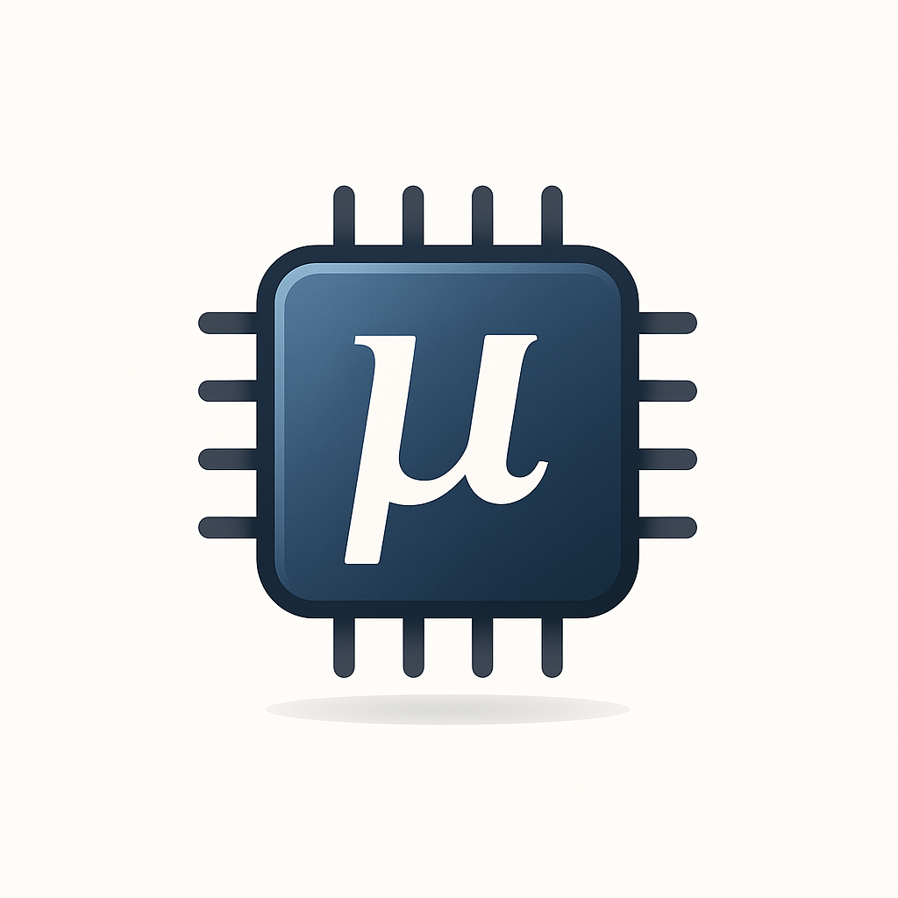

<p align="center"></p>

# Mugen

Mugen is a microcode generator that converts a structured specification file into binary microcode images. These images can be flashed onto ROM chips for use in 8-bit computers, such as Ben Eater's breadboard computer. The tool allows hobbyists to define execution sequences for their own CPU designs in a clear and maintainable way.


## Installation

To build and install Mugen, run the following commands from the src folder:

```sh
make
sudo make install
```

This will compile the source code and install the `mugen` binary into `/usr/local/bin`.

## Usage

Run Mugen with a specification file to generate one or more output-files:

```sh
mugen input.mu microcode.bin
```
Depending on the extension of the output file, different output is generated.

| Extension           | Output                        |
|---------------------|-------------------------------|
| .bin, .rom          | Binary files                  |
| .c, .cc, .cpp, .cxx | C/C++ source and header file. |

When multiple ROM chips are used (as specified in the rom section, see below), multiple files may be generated, e.g. microcode.bin.0, microcode.bin.1, etc.

### C/C++ Source files
The C/C++ sourcefiles can be included and linked to your C or C++ project. Depending on wether you're using a C or C++ compiler, the generated microcode images will be available in the `mugen_images` (C) or `Mugen::images` (C++) variables. These are 2D arrays of `unsigned char`, where the first index is the image-index and the second index is the byte-index (or address to the ROM). Furthermore, the constants `N_IMAGES` and `IMAGE_SIZE` are available to iterate over the `images`.

  ```sh
  $ mugen spec.mu microcode.cc
  Successfully created CPP source files: microcode.cc, microcode.h.
  ```

  ```cpp
  // C++ Header
  namespace Mugen {
	constexpr size_t IMAGE_SIZE /* = value */;
	constexpr size_t N_IMAGES /* = value */;
    extern unsigned char const images[N_IMAGES][IMAGE_SIZE];
  }
  
  // C Header
  #define IMAGE_SIZE // value
  #define N_IMAGES // value
  extern unsigned char const mugen_images[N_IMAGES][IMAGE_SIZE];
  ```

### Printing Layout
The `--layout` or `-l` flag can be passed to Mugen if you want to see (or save for reference) the resulting memory layout. It will show what signals will be stored in which bit of every ROM chip and provide an overview of how each address-bit has been defined.

```sh
mugen input.mu microcode.bin --layout
```

### Debug Mode
When `--debug` or `-d` option is used, Mugen will start an interactive shell in which you can inspect the result before writing it to disk. Type `help` in this shell for more information.

## Specification File Format

A Mugen specification file (.mu) contains the following sections: `signals`, `opcodes`, `macros`, `microcode`, `address` and `rom`. Only the `macros` section is optional; all other sections must appear somewhere in the .mu-file, but the order in which they do is left up to the user. Outside these sections, only comments are permitted. Comments start with a `#` and end at the end of the line.

### ROM Configuration
Defines ROM parameters (number of words and bits per word). Currently only 8 bit ROM is supported. 

```
[rom] {
    8192x8
}
```
An optional third parameter can be added when using multiple rom chips.

```
[rom] {
    8192x8x3
}
```

### Address Breakdown
Specifies how the microcode is addressed. The values specify the number of bits used for each part of the address. 

```
[address] {
    cycle:  3
    opcode: 4
    flags:  2
}
```

The order in which these are declared determines their position in the address. For example, the declaration above leads to the following configuration (for a 8192 byte ROM):

``` 
Address Bit: 13 12 11 10 09 08 07 06 05 04 03 02 01 00 
              X  X  X  X  X  F  F  O  O  O  O  C  C  C
```

#### Named Flags
Alternatively, flags may be named. This has the benefit of self-documentation with respect to the order of the flags in the specification itself. Furthermore, it allows you to use a more explicit syntax in the microcode definitions and, when in debug-mode or when using the `--layout` option, the flag-names will be printed for clarity.

```
[address] {
    cycle:  3
    opcode: 4
    flags:  C, Z # equivalent to 'flags: 2'
}
```


#### No Flags
It is possible to define a system where no flags are used (for example when building Ben Eater's 8-bit computer, it is possible to run it in an intermediate stage where it is not Turing Complete yet). Simply assign 0 bits to the flag field of the address or omit the flag-line altogether.


#### Segments
The address space may be segmented to allow for groups of 8 control signals to be stored in different segments of the same chip. The hardware must then be designed to sequentially load these signals from the different segments by enabling the corresponding segment bits. For example, when using 2 segment bits (4 segments), 32 signals can be stored on the same chip.

```
[address] {
    cycle:   3  # bits 0-2
    opcode:  4  # bits 3-6
    flags:   2  # bits 7-8
    segment: 2  # bits 9-10 are used to select the ROM segment
}
```

#### Padding
By default, Mugen will create images of size `2^(sum of bits)` based on the specified bits in the address section. When not all address lines are used, this will result in images smaller than the actual number of words available on the ROM (see rom-section) to minimize the time needed to flash the images to the chip(s). The `--pad` or `-p` option can be passed to Mugen to pad the remaining address-space with some hex value:

```sh
mugen spec.mu image.bin --pad 0xff
```

Alternatively, `--pad catch` can be used (only) when a catch-rule was specified in the microcode section (see below). With this option, the catch-rule will also be applied to all addresses outside the addressable space of the ROM. 

### Signals
This section lists all control signals used in the microcode. Each signal must be a valid identifier (a combination of alphanumeric characters or underscores) and be listed on a seperate line. At most 64 signals may be declared.

```
[signals] {
    HLT
    MI
    RI
    RO
    IO
    II
    #...
}
```

#### Empty Slots
To create an empty slot (an unconnected pin in hardware), simply put a single dash (-) in the corresponding location of the list.
```
[signals] {
    HLT
    MI
    RI
    -     # empty
    IO
    II
    #...
}
```


#### Signal Indices
Signals are grouped into chunks of 8. The first chunk will be stored to the first chip, the second to the second chip and so on. When the chips have been segmented, sequential chunks are first stored in segment 0 of the corresponding ROM chips, then to segment 1 and so on. Given `n` available ROM chips, a chunk with index `c` will be stored in ROM `floor(c / n)`, segment `mod(c, n)`. Signals are stored starting from the least significant bit, unless  Mugen is called with the `--msb-first` or `-m` flag. Call Mugen with the `--layout` option for an overview of where each of signals has ended up. 

### Opcodes
This section defines the available opcodes and assigns their numerical values (in hex). Each opcode must be defined on its own line.

```
[opcodes] {
    LDA = 0x01   # these must be hexadecimal values
    ADD = 0x02
    OUT = 0x0e
    #...
}
```

### Macro's
It is very common for certain clusters of control signals to appear again and again because these represent some common operation that requires multiple signals to be asserted at the same time. The optional `macro` section allows you to define these clusters and name them appropriately. These macro names can then be used instead of (or in conjunction with) the signals previously defined in the `signals` section.
```
[macros] {
  # Register Select
  R_D  = RS0
  R_DP = RS1
  R_SP = RS0, RS1
  R_IP = RS2
  R_LS = RS0, RS2

  # Modify Data
  INC_D = INC, R_D, SET_V   # using macro R_D as an alias for RS0
  DEC_D = DEC, R_D, SET_V
  
  # ...
}
```

### Microcode Definitions
The final section sets the control signals for each instruction cycle. Each line specificies the opcode, cycle and flag configuration followed by `->` and a list of control signals (which may be empty) and/or macro's. Wildcards denoted `x` will be matched to any opcode, any cycle number within the specified range or either 0 or 1 in the case of the flags.

#### Legacy Syntax
In older versions of Mugen, the flag configuration was represented by a string of 0's, 1's and x's, which made it hard to parse for humans because they'd have to memorize the flag-order. This could get especially confusing when dealing with many flags. The order of the flag bits in these rule-definitions is exactly how they will appear on the address lines to the ROM. For example, the rule ADD:1:01 will map to a situation where bit 0 of the flag-field is 1 and bit 1 is 0. If using named flags, the order is determined by the order in which the flags were declared in the address-section.

```
[microcode] {
  # ...

  PLUS:1:xx00x          -> INC, RS0, SET_V, LD_FA
  PLUS:2:xx00x          -> INC, RS2, CR
  PLUS:1:xx10x          -> LD_D, OE_RAM
  PLUS:2:xx10x          -> INC, RS0, SET_V, LD_FA
  PLUS:3:xx10x          -> INC, RS2, CR
  PLUS:1:xxx1x          -> INC, RS2, CR

  # ...
}
```

#### New Syntax
In current versions of Mugen, flag states can be made more explicit using the syntax below. In this new syntax, flags that have no value assigned to them are treated as wildcards. Empty brackets will therefore match any configuration. For this syntax to work, named flags should have been defined in the `address` section.

```
  # ...

  PLUS:1:(A=0,S=0)		-> INC, RS0, SET_V, LD_FA
  PLUS:2:(A=0,S=0)		-> INC, RS2, CR
  PLUS:1:(A=1,S=0)		-> LD_D, OE_RAM
  PLUS:2:(A=1,S=0)		-> INC, RS0, SET_V, LD_FA
  PLUS:3:(A=1,S=0)		-> INC, RS2, CR
  PLUS:1:(S=1)			-> INC, RS2, CR

  # ...
  
  NOP:x:()              -> # Any cycle, any state, do nothing
```


#### catch
It might be useful to fill all yet undefined addresses with some kind of error-signal to indicate that the computer ended up in some undefined state. This can be done using wildcards or the reserved `catch` keyword. In either case below, all remaining cells will be assigned the ERR and HLT signal.

```
[microcode] {
    # all previous rules
    
    catch    -> ERR, HLT
    x:x:xxxx -> ERR, HLT   # this is equivalent
	x:x:()   -> ERR, HLT   # and this too
}
```

Only the catch rule is allowed to overlap with preceding rules. On every other rule an error will be raised when it is found to overlap with previously defined rules. Any normal rule following a catch-rule will always collide with the catch itself and is ignored to allow for an early return (equivalent to commenting out everything below the catch).

```
[microcode] {
    # ...
    LDA:2:0x -> MI, IO
    LDA:2:01 -> R0, AI   # will collide with the rule above
    # ...
    catch    -> ERR, HLT # won't collide by definition

    # Anything below the catch will be ignored
}
```

#### No Flags
When the system has no flag bits mapped onto the address (i.e. the flag field in the address-section was left out or assigned 0), the third part of each microcode rule is simply left out.

```
[microcode] {
    # ...
    LDA:2 -> MI, IO
    # ...
}
```

## Example
When Mugen is run on the unsegmented BFCPU specification in the examples-folder of this repository, the following output is generated:

```
$ mugen bfcpu.mu bfcpu.bin --pad catch --layout
Successfully generated 3 images from bfcpu.mu: 

  ROM 0: bfcpu.bin.0 (8192 bytes)
  ROM 1: bfcpu.bin.1 (8192 bytes)
  ROM 2: bfcpu.bin.2 (8192 bytes)


  [ROM 0, Segment 0] {
    0: HLT
    1: RS0
    2: RS1
    3: RS2
    4: INC
    5: DEC
    6: DPR
    7: EN_SP
  }

  [ROM 1, Segment 0] {
    0: OE_RAM
    1: WE_RAM
    2: EN_IN
    3: EN_OUT
    4: EN_V
    5: EN_A
    6: LD_FBI
    7: LD_FA
  }

  [ROM 2, Segment 0] {
    0: EN_IP
    1: LD_IP
    2: EN_D
    3: LD_D
    4: CR
    5: CLR_K
    6: UNUSED
    7: ERR
  }

  [Address Layout] {
    0: CYCLE BIT 0
    1: CYCLE BIT 1
    2: CYCLE BIT 2
    3: OPCODE BIT 0
    4: OPCODE BIT 1
    5: OPCODE BIT 2
    6: OPCODE BIT 3
    7: Z
    8: S
    9: A
    10: V
    11: K
    12: UNUSED
  }
```
